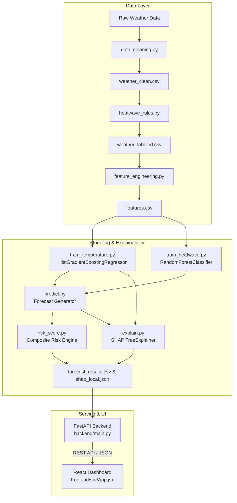

# HeatWatch AI: Hyperlocal Heatwave Prediction & Explainable Early Warning System

[](https://www.python.org/)
[](https://fastapi.tiangolo.com/)
[](https://react.dev/)
[](https://vitejs.dev/)
[](https://scikit-learn.org/)
[](https://shap.readthedocs.io/)
[](LICENSE)

An end-to-end, machine learning-powered early warning system designed for **hyperlocal heatwave prediction, terrain-aware risk assessment, and explainable climate intelligence**. HeatWatch AI combines meteorological data processing, time-series feature engineering, dual-stage machine learning (temperature regression + heatwave classification), Explainable AI (SHAP), a high-performance FastAPI backend, and an interactive React dashboard.

---

## Table of Contents

- [Overview](#overview)
- [Key Features](#key-features)
- [Architecture & Workflow](#architecture--workflow)
- [Climatological Thresholds & Terrain Rules](#climatological-thresholds--terrain-rules)
- [Machine Learning Pipeline](#machine-learning-pipeline)
  - [Regression: Maximum Temperature Forecast](#regression-maximum-temperature-forecast)
  - [Classification: Heatwave Occurrence & Severity](#classification-heatwave-occurrence--severity)
  - [Explainable AI (SHAP)](#explainable-ai-shap)
- [Composite Heat Risk Scoring](#composite-heat-risk-scoring)
- [Project Structure](#project-structure)
- [Monitored Locations](#monitored-locations)
- [Getting Started](#getting-started)
  - [Prerequisites](#prerequisites)
  - [1. Clone Repository & Setup Environment](#1-clone-repository--setup-environment)
  - [2. Run the Machine Learning Pipeline](#2-run-the-machine-learning-pipeline)
  - [3. Start the FastAPI Backend](#3-start-the-fastapi-backend)
  - [4. Start the React Frontend](#4-start-the-react-frontend)
- [API Reference](#api-reference)
- [Testing & Quality Assurance](#testing--quality-assurance)
- [License](#license)

---

## Overview

Heatwaves are among the deadliest extreme weather events driven by climate change, yet conventional meteorological advisories are frequently too broad to trigger timely, local interventions. 

**HeatWatch AI** bridges this gap by:
1. Forecasting next-day maximum temperature (test MAE ≈ 0.99 °C on the 5 training cities).
2. Applying localized, India Meteorological Department (IMD) compliant thresholds across distinct terrain categories (**Plains**, **Hilly**, and **Coastal** regions).
3. Predicting the probability and severity of heatwaves using supervised ensemble learning.
4. Computing a **Composite Heat Risk Index (0–100)** incorporating thermal stress, departures from normal, persistence, and relative humidity.
5. Providing **SHAP-based local and global explanations** so meteorologists and public officials understand *why* an alert was issued.
6. Dispatching targeted, tiered public health advisories for vulnerable populations (outdoor laborers, elderly, and children).

---

## Key Features

- **Hyperlocal Weather Modeling**: Tailored to distinct geographic and climatic topographies across India (Pune, Mumbai, Delhi, Bengaluru, Shimla).
- **Dual-Model ML Architecture**:
  - **HistGradientBoosting Regressor**: Predicts continuous next-day maximum temperatures (`target_temperature_max`).
  - **Random Forest Classifiers**: Predicts binary heatwave occurrence and multi-class severity (`Normal`, `Heatwave`, `Severe Heatwave`).
- **Terrain-Aware Rule Engine**: Dynamically calculates climatological normal temperatures and departure deviations adhering to IMD criteria for coastal, plains, and hill stations.
- **Explainable AI (XAI)**:
  - Local per-city waterfall attribution explaining key drivers (e.g., lag temperatures, humidity drops, wind speed, rolling averages).
  - Global feature importance summaries for transparent model governance.
- **Composite Heat Risk Score (CHRS)**: Weighted multi-criteria index categorizing risk into 5 actionable levels: `Low`, `Moderate`, `High`, `Very High`, and `Extreme`.
- **FastAPI REST Service**: Clean, typed endpoints with CORS support, sub-millisecond response times, and automated OpenAPI documentation.
- **Modern React + Vite Dashboard**: Real-time hotspot maps, severity gauges, historical comparisons, interactive charts, and SHAP feature impact visualizers.

---

## Architecture & Workflow



---

## Climatological Thresholds & Terrain Rules

Heatwave definitions depend heavily on local geography. HeatWatch AI implements standardized criteria based on climatological normal baselines:

| Region Type | Absolute Temp Threshold | Departure from Normal | Severe Departure Threshold |
| :--- | :---: | :---: | :---: |
| **Plains** (Delhi, Pune, Bengaluru) | $\ge 40.0^\circ\text{C}$ | $+4.5^\circ\text{C}$ | $+6.5^\circ\text{C}$ |
| **Coastal** (Mumbai) | $\ge 37.0^\circ\text{C}$ | $+4.5^\circ\text{C}$ | $+6.5^\circ\text{C}$ |
| **Hilly** (Shimla) | $\ge 30.0^\circ\text{C}$ | $+4.5^\circ\text{C}$ | $+6.5^\circ\text{C}$ |

> **IMD Heatwave Condition**: A heatwave is declared if the normal maximum temperature of a station is $> 40^\circ\text{C}$ and departure is $\ge 4.5^\circ\text{C}$, or when actual maximum temperature reaches $\ge 45^\circ\text{C}$ (plains).

---

## Machine Learning Pipeline

### Regression: Maximum Temperature Forecast
- **Model**: `HistGradientBoostingRegressor(max_iter=500, learning_rate=0.05)`, chosen on 2023 validation MAE over the original 300-tree Random Forest (366 MB) and two smaller forests. 0.2 MB on disk.
- **Target**: Next-day maximum temperature (`target_temperature_max`)
- **Key Features**: 
  - Autoregressive lags: `temp_max_lag_1`, `temp_max_lag_2`, `temp_max_lag_3`
  - Rolling aggregates: `temp_max_rolling_3`, `temp_max_rolling_7`
  - Microclimate factors: `humidity_lag_1`, `wind_lag_1`, `precip_3d`, `temp_trend_3d`
  - Climatology: `departure`, `normal_max_temp`, `month`, `day_of_year`
  - No latitude/longitude: with only 5 training cities they let the models memorise city identity.

**Benchmark Performance:**
| Dataset Split | Mean Absolute Error (MAE) | Root Mean Squared Error (RMSE) | $R^2$ Score |
| :--- | :---: | :---: | :---: |
| **Validation (2023)** | 0.95 °C | 1.31 °C | 0.964 |
| **Test (2024)** | 0.99 °C | 1.34 °C | 0.967 |

### Classification: Heatwave Occurrence & Severity
- **Occurrence Model**: Binary `RandomForestClassifier(n_estimators=300, min_samples_leaf=5, max_depth=12, class_weight="balanced")`, 0.5 threshold, predicting whether heatwave criteria will be breached tomorrow. It was chosen on 2023 validation PR-AUC over the unconstrained forest and HistGradientBoosting. Validation has only 4 heatwave days, so treat that choice as tentative. Heatwave days are rare (36 of 3,650 validation + test city-days), so accuracy and weighted F1 are misleading. Honest rare-class results:

  | Split | Heatwave days | Caught (recall) | False alarms | Precision | F1 | PR-AUC | Brier |
  | :--- | :---: | :---: | :---: | :---: | :---: | :---: | :---: |
  | Validation (2023) | 4 | 1 (0.25) | 4 | 0.20 | 0.22 | 0.13 | 0.003 |
  | Test (2024) | 32 | 23 (0.72) | 16 | 0.59 | 0.65 | 0.66 | 0.012 |

  The previous unconstrained forest caught 0/4 and 9/32. Probabilities are not calibrated. The service also applies the IMD rules to the predicted temperature and reports the higher severity.
- **Severity Model**: Multi-class `RandomForestClassifier` assessing degree of event:
  - `0`: Normal
  - `1`: Heatwave
  - `2`: Severe Heatwave
  - **Macro F1**: 0.50 (validation), 0.45 (test). Weighted F1 (0.98) mostly reflects the non-heatwave class.

### Explainable AI (SHAP)
Using `shap.TreeExplainer`, the system computes local attribution values for every forecast:
- Quantifies positive/negative contribution ($^\circ\text{C}$) of each meteorological feature.
- Generates `visualizations/shap_summary.png` and local JSON explanations for client-side waterfall plots.
- Enables operational transparency and prevents "black-box" alerting failures.

---

## Composite Heat Risk Scoring

The **Composite Heat Risk Score (CHRS)** scales from **0 to 100**, synthesizing five critical dimensions:

$$\text{CHRS} = 0.40 \cdot S_{\text{temp}} + 0.25 \cdot S_{\text{prob}} + 0.20 \cdot S_{\text{anomaly}} + 0.10 \cdot S_{\text{persist}} + 0.05 \cdot S_{\text{humidity}}$$

| Score Range | Risk Category | Advisory Level | Action Recommended |
| :---: | :---: | :---: | :--- |
| **0 – 19** | **Low** | Green | Normal outdoor activities permitted. Standard hydration. |
| **20 – 39** | **Moderate** | Yellow | Monitor conditions; limit intense midday sun exposure. |
| **40 – 59** | **High** | Orange | High alert for vulnerable populations; mandate shaded breaks for laborers. |
| **60 – 79** | **Very High** | Red | Avoid outdoor activity from 11 AM - 4 PM; active hydration centers required. |
| **80 – 100** | **Extreme** | Dark Red / Emergency | Health emergency; severe heat stroke risk; suspend heavy outdoor labor. |

---

## Project Structure

```plaintext
heatwave-intelligence/
├── backend/
│   └── main.py                     # FastAPI REST server & endpoint controllers
├── config/
│   ├── locations.csv               # Monitored locations (coordinates & terrain type)
│   └── thresholds.yaml             # Regional thresholds and risk weight definitions
├── data/
│   ├── raw/                        # Raw historical weather observations
│   └── processed/                  # Cleaned, labeled, and feature-engineered datasets
├── frontend/
│   ├── src/
│   │   ├── App.jsx                 # Interactive React dashboard
│   │   ├── App.css                 # Custom glassmorphic & responsive styling
│   │   └── main.jsx                # Application root entrypoint
│   ├── index.html
│   ├── package.json
│   └── vite.config.js
├── models/
│   ├── temperature_model.joblib    # Trained HistGradientBoosting Regressor
│   ├── heatwave_model.joblib       # Trained Heatwave Occurrence Classifier
│   ├── severity_model.joblib       # Trained Severity Classifier
│   ├── temperature_features.joblib # Regression feature list
│   └── classification_features.joblib
├── outputs/
│   ├── advisories/                 # Generated public health advisories
│   ├── explanations/               # Local SHAP JSON outputs
│   ├── metrics/                    # Regression & classification validation metrics
│   └── predictions/                # Latest forecast results (forecast_results.csv)
├── src/
│   ├── advisory.py                 # Public health advisory logic
│   ├── data_cleaning.py            # Missing value handling & quality checks
│   ├── data_download.py            # Weather data ingestion utilities
│   ├── explain.py                  # SHAP explanation pipeline
│   ├── feature_engineering.py      # Rolling windows, lags, and meteorological indicators
│   ├── heatwave_rules.py           # IMD threshold labeling & normal baseline calculation
│   ├── predict.py                  # End-to-end inference engine
│   ├── risk_score.py               # Composite heat risk computation
│   ├── train_heatwave.py           # Heatwave classification training
│   ├── train_temperature.py        # Temperature regression training
│   ├── validate.py                 # Model validation & cross-validation checks
│   └── visualization.py            # Static charts and HTML maps generator
├── tests/
│   └── test_pipeline.py            # End-to-end unit and integration test suite
├── visualizations/                 # Generated figures, HTML maps, and SHAP plots
├── requirements.txt                # Python dependencies
└── README.md                       # Project documentation
```

---

## Monitored Locations

| Location ID | City | State | Latitude | Longitude | Region Type |
| :--- | :--- | :--- | :---: | :---: | :--- |
| `PUNE_01` | Pune | Maharashtra | 18.5204 | 73.8567 | Plains |
| `MUM_01` | Mumbai | Maharashtra | 19.0760 | 72.8777 | Coastal |
| `DEL_01` | Delhi | Delhi | 28.6139 | 77.2090 | Plains |
| `BENG_01` | Bengaluru | Karnataka | 12.9716 | 77.5946 | Plains |
| `SHIM_01` | Shimla | Himachal Pradesh | 31.1048 | 77.1734 | Hilly |

---

## Getting Started

### Prerequisites
- **Python 3.10+**
- **Node.js 18+** & **npm**

### 1. Clone Repository & Setup Environment

```bash
# Clone the repository
git clone https://github.com/<your-username>/heatwave-intelligence.git
cd heatwave-intelligence

# Create and activate Python virtual environment
python3 -m venv .venv
source .venv/bin/activate    # On Windows: .venv\Scripts\activate

# Install Python dependencies
pip install -r requirements.txt
```

### 2. Run the Machine Learning Pipeline

The processed 5-city training set (2015–2024) is committed in `data/processed/`, so retraining only needs:

```bash
python src/train_temperature.py
python src/train_heatwave.py
```

Live predictions no longer need a batch step: the API fetches weather for any point on demand.
The trained models (~1.6 MB in total) are committed in `models/`, so a fresh clone can start the API without retraining.

### 3. Start the FastAPI Backend

```bash
# Launch FastAPI with auto-reload
uvicorn backend.main:app --host 0.0.0.0 --port 8000 --reload
```
API Documentation will be available at:
- Swagger UI: [http://localhost:8000/docs](http://localhost:8000/docs)
- ReDoc: [http://localhost:8000/redoc](http://localhost:8000/redoc)

### 4. Start the React Frontend

Open a new terminal session:

```bash
cd frontend

# Install UI dependencies
npm install

# Start development server
npm run dev
```
Open your browser at **`http://localhost:5173`** to access the HeatWatch AI Dashboard.

---

## API Reference

The full contract, with real example responses for every endpoint, is in [docs/API.md](docs/API.md).

| Method | Endpoint | Description |
| :--- | :--- | :--- |
| `GET` | `/api/search?q=` | Place autocomplete, India only |
| `GET` | `/api/reverse?lat=&lon=` | Place name for a map click |
| `GET` | `/api/risk?lat=&lon=` | Tomorrow's prediction, risk score, advisory, 7-day outlook for any point in India |
| `GET` | `/api/explain?lat=&lon=` | SHAP breakdown of tomorrow's predictions |
| `GET` | `/api/featured` | Tomorrow's risk for the featured places in `config/locations.csv` |
| `GET` | `/api/health` | Models loaded, upstream reachable, cache counts |

Points outside India return 400. CORS origins come from `CORS_ORIGINS` in `.env` (see `.env.example`).

---

## Testing & Quality Assurance

HeatWatch AI includes an automated test suite verifying dataset integrity, model persistence, forecast generation, and API schema compliance:

```bash
# Run the whole suite (Open-Meteo is mocked; no network needed)
pytest tests -v
```

---

## Limitations

The temperature, heatwave and severity models were trained on only five cities (Pune, Mumbai, Delhi, Bengaluru and Shimla, 2015–2022). The API runs them anywhere in India, but accuracy is lower in climates unlike those five, such as the Thar desert, the Northeast, the islands or high Himalayan sites. The heatwave classifier caught 9 of 32 heatwave days in the 2024 test year. Weather and normals come from ~9–25 km gridded models, not station observations. Normals come from ERA5 reanalysis and are shifted by the forecast-vs-ERA5 difference measured over the last ~9 overlapping days (`normal_bias_correction_c`). That removes most of the gap between the two sources, but a 9-day sample is noisy. ERA5 cells near the coast can still run cooler than the city's weather station. For Mumbai in early October 2026 the corrected normal is ~31.7 °C, against a station normal of roughly 33–34 °C. Treat outputs as decision support, not as official IMD warnings.

---

## License

This project is licensed under the MIT License - see the [LICENSE](LICENSE) file for details.
